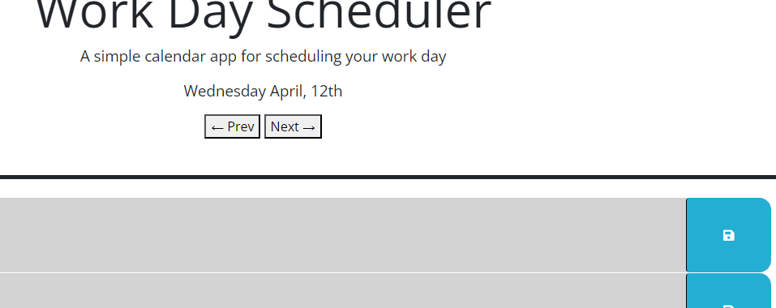

# Work Scheduler

## Description

Something that you can just sit down at and not get distracted with while you go about making your schedule for the day.
Work out and plan out everything that you will need to do for the day right here and don't worry about loosing your notes since we
are utilizing the browsers localStorage in order to keep your data persistant. Just Try not to keep anything to sensitive on here.

## Installation

Fork or Clone this repository on your local machine and open it up with your browser however you decide.
Or you could just come check it out live [Right Here!!]()

## Usage

Here is how it should look when you first load the page with the current day displayed and the current time hightlighted red. Currently took the screenshot after 6PM but will update to the correct display when you are within the work hours.

You can Save Your planned events by writing within the time block and clicking the save button.

Now when you refresh the page you will get the data loaded back into the correct spot.

Here I have set up a simple way of looking at the previous and next days of the display and this will update the timeblocks with the correct saved data for that day.

## License

Refer to the LICENSE file within the repository
